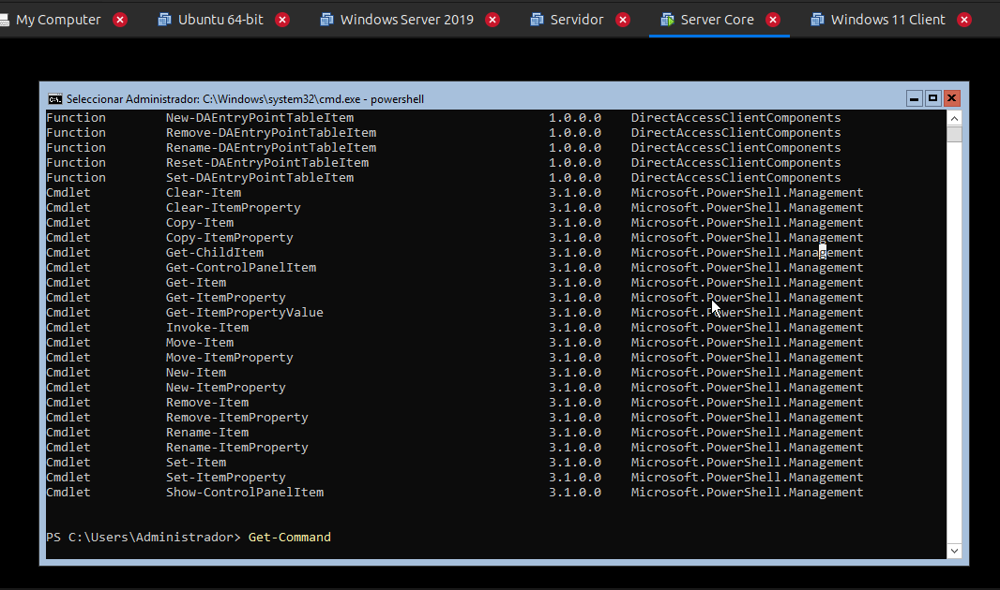
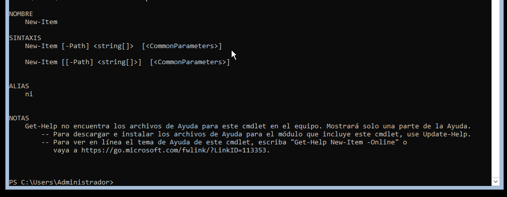
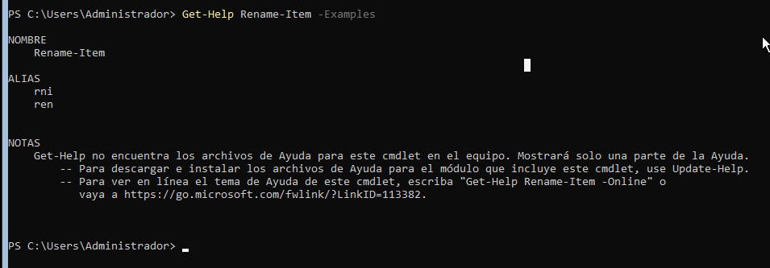
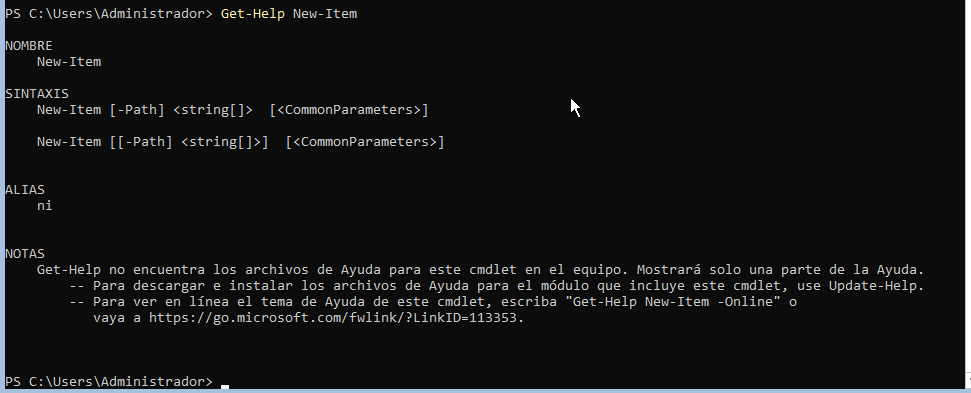
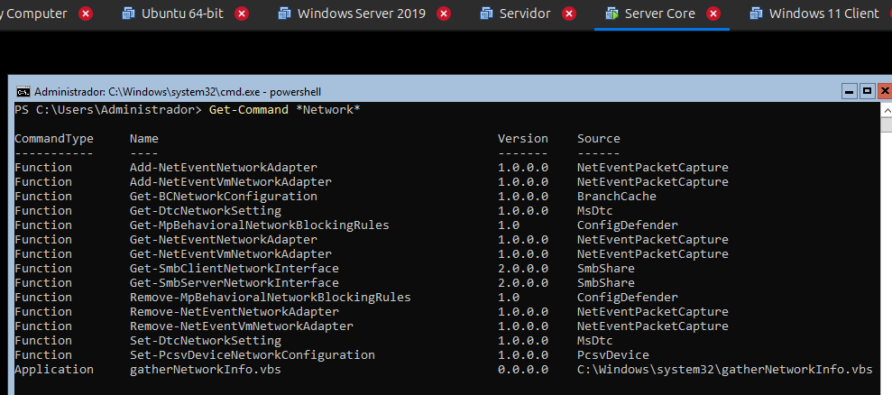
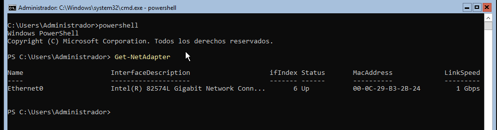
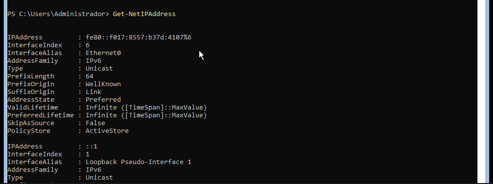
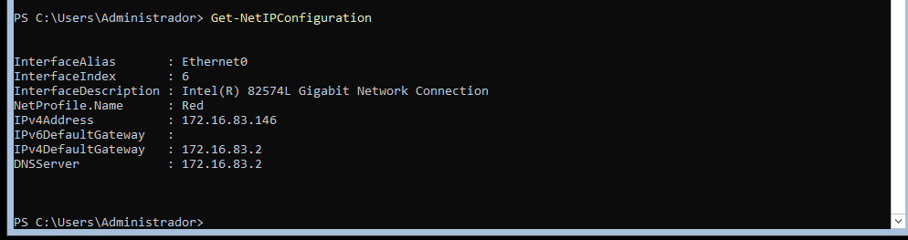
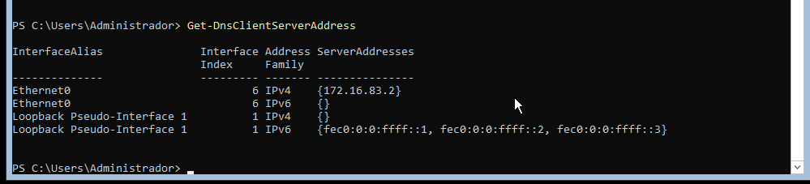
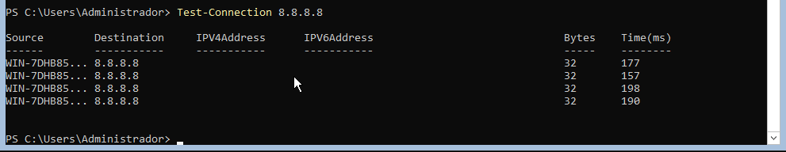

> **Nota**: Els exercicis/pràctiques t'han de servir per a familiarizar-te amb el llenguatge Powershell. Aprofita per a realitzar diverses proves i veure què passa. Documenta també aquestes proves i resultats.

# Treballar amb fitxers i carpetes

**Situació:** encara no hem estudiat les ordres de PowerShell per treballar amb fitxers i carpetes. Les haurem de descobrir utilitzant les eines d'ajuda de PowerShell.

**1. Buscar ordres**

Busca cmdlets que continguin la paraula `Item`:

```
Get-Command *Item*
```

Observa les ordres que apareixen.

Intenta identificar quina ordre podria servir per:

- crear un element : *New-Item*
- eliminar un element : *Remove-Item*
- canviar el nom d'un element : *Rename-Item*
- copiar un element :  *Copy-Item*
- moure un element : *Move-Item*



---

**2. Investigar una ordre**

Sense executar-la encara, consulta què fa:

```
Get-Help New-Item
```

Respon:

- Per a què serveix `New-Item`?
Serveix per crear elements nous, principalment fitxers i directoris (carpetes).

- Quina estructura té l'ordre?

```powershell
New-Item -Path <ruta> -ItemType <tipus>
```

Consulta alguns exemples:

```
Get-Help New-Item -Examples

```


---

**3. Descobrir un paràmetre**

Consulta què significa el paràmetre `-ItemType`:
Indica quin tipus d'element volem crear amb *New-Item*.

```
Get-Help New-Item -Parameter ItemType
```

A partir de l'ajuda, intenta descobrir com crear una carpeta.

Per exemple, haurien d'arribar a alguna cosa semblant a

Per crear una carpeta, utilitzem:
```powershell
New-Item -ItemType Directory -Name Prova
```
-*New-Item* → crea un element nou.

-*ItemType Directory* → indica que volem crear una carpeta.

-*Name Prova* → indica que la carpeta es dirà Prova.

---

**4. Nou repte**

Ara necessites saber com **canviar el nom de la carpeta**, però no coneixes l'ordre.

Utilitza:

```
Get-Command *Item*
```

i després consulta l'ajuda de l'ordre que creguis adequada.

L'objectiu és arribar a descobrir:

```
Rename-Item
```


i consultar:

```
Get-Help Rename-Item -Examples
```


---

Sense utilitzar Internet, descobreix quins cmdlets faries servir per:

| Acció             | Cmdlet        | Exemple                                    |
| ----------------- | ------------- | ------------------------------------------ |
| Crear una carpeta | `New-Item`    | `New-Item -ItemType Directory -Name Prova` |
| Canviar-li el nom | `Rename-Item` | `Rename-Item Prova NovaProva`              |
| Copiar-la         | `Copy-Item`   | `Copy-Item NovaProva C:\Copia`             |
| Moure-la          | `Move-Item`   | `Move-Item NovaProva C:\Destinacio`        |
| Eliminar-la       | `Remove-Item` | `Remove-Item NovaProva`                    |


**Condició:** només pots utilitzar `Get-Command` i `Get-Help` per investigar les ordres.


Descobrir ordres de xarxa amb PowerShell

## Situació

Estàs administrant un servidor Windows i necessites consultar informació de la seva configuració de xarxa.

Encara no coneixes les ordres de PowerShell relacionades amb xarxa.

La teva feina és descobrir-les utilitzant principalment:

```
Get-Command
Get-Help
```

No pots buscar les respostes a Internet.

---

## Tasques

Descobreix quines ordres de PowerShell et permeten obtenir la informació següent:

- Per descobrir les ordres de xarxa podem començar buscant cmdlets relacionats amb Network:



1. Mostrar els adaptadors de xarxa de l’equip. 
     

2. Consultar les adreces IP configurades.  


3. Consultar la configuració IP completa dels 
adaptadors de xarxa.      


4. Consultar els servidors DNS configurats. 


5. Comprovar si hi ha connectivitat amb un altre equip de la xarxa.  


---
## Per cada tasca

Indica:

- el cmdlet que has trobat;      
- com l’has localitzat amb `Get-Command`;  
- una breu explicació del que fa;  
- la comanda que has executat;  
- el resultat obtingut.  

L'objectiu és que hi hagi una traçabilitat de com s'ha arribat a la comanda final.